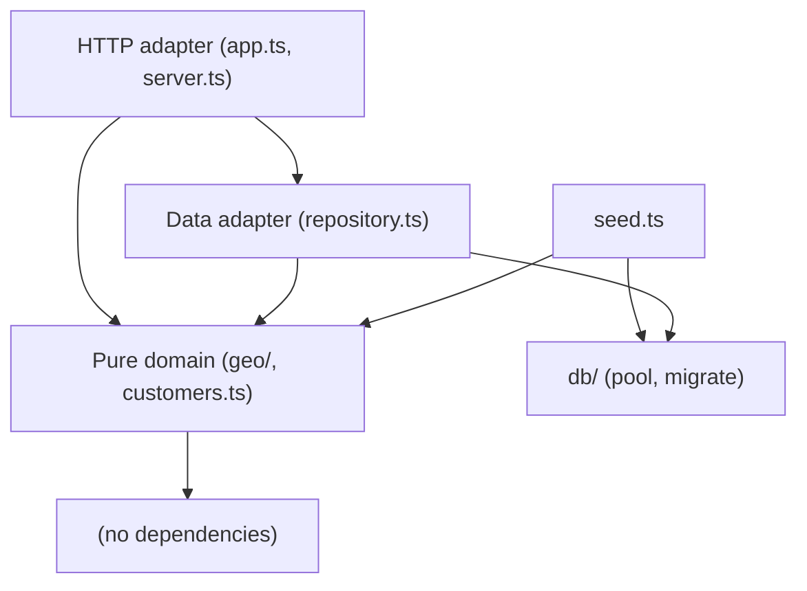
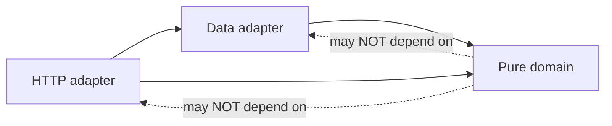

# Architecture Spine — customers-distance-service

## Design Paradigm

**Layered, with a pure-domain core.** Business logic (distance, city normalization,
sorting) is pure and IO-free; the database and HTTP are thin adapters around it.

Layer → directory map:
- `src/geo/`, `src/customers.ts` — pure domain (no IO).
- `src/db/`, `src/repository.ts`, `src/seed.ts` — data adapter (Postgres).
- `src/app.ts`, `src/server.ts` — HTTP adapter (Express).
- `src/config.ts` — configuration.



## Invariants & Rules

### AD-1 — Dependency direction is inward to the pure domain
- **Binds:** all
- **Prevents:** business logic leaking into HTTP/DB adapters, and the domain taking
  on IO (which would break offline determinism and unit-testability).
- **Rule:** `geo/` and `customers.ts` import no Express, no `pg`, no `fs`/network.
  Adapters may depend on the domain; the domain depends on nothing project-internal
  except other pure modules.

### AD-2 — Distance & ordering are pure, unit-tested functions [ADOPTED]
- **Binds:** FR-6, FR-6 NFR
- **Prevents:** distance/sorting logic entangled with SQL or HTTP, which would make
  it untestable and non-deterministic.
- **Rule:** haversine, distance-from-Budapest, rounding, and the by-distance sort
  live in pure functions and are covered by unit tests. SQL does not compute or
  order by distance.

### AD-3 — Geocoding is offline, from a bundled reference [ADOPTED]
- **Binds:** FR-2, FR-3, FR-4
- **Prevents:** any runtime dependency on an external geocoding API or LLM.
- **Rule:** coordinates come only from an in-repo `telepules → {lat,lon}` map. No
  network/LLM call at seed or request time. Matching uses Normalization
  (accent-stripped, lowercased, trimmed, whitespace-collapsed); "budapest" substring
  resolves to the Budapest reference point.

### AD-4 — Idempotency via a natural-key upsert [ADOPTED]
- **Binds:** FR-1
- **Prevents:** duplicate rows when the seed is re-run.
- **Rule:** `customers` has `UNIQUE(name, telepules)`; the seed inserts with
  `ON CONFLICT (name, telepules) DO UPDATE`.

### AD-5 — Distance is derived at query time, not stored
- **Binds:** FR-6
- **Prevents:** a persisted-distance column drifting from coordinates and adding
  write-time complexity.
- **Rule:** the store holds `lat/lon`; `distanceKm` is computed per request in the
  domain layer and rounded to 1 decimal there.

### AD-6 — Unknown coordinates are null and sort last
- **Binds:** FR-4, FR-6
- **Prevents:** crashes or arbitrary placement for customers without coordinates.
- **Rule:** missing coordinates → `distanceKm: null`; the sort puts null-distance
  customers after all known ones; ties (equal distance) break by `name` ascending.

### AD-7 — Single source for the Budapest reference point
- **Binds:** FR-6
- **Prevents:** divergent origin constants between seed-time and query-time logic.
- **Rule:** `lat 47.4979, lon 19.0402` is defined once in the domain and reused.



## Consistency Conventions

| Concern | Convention |
| --- | --- |
| Naming | Domain term for city is `telepules` everywhere (DB column, DTO field). DB columns snake_case; JSON DTO camelCase (`countryCode`, `distanceKm`). |
| Data & formats | `lat`/`lon` = `DOUBLE PRECISION` nullable; `distanceKm` number to 1 decimal or `null`; count is an integer (`COUNT(*)::int`). |
| Error shape | Unexpected failures → HTTP 500 `{ "error": <string> }` via one Express error handler. |
| State & cross-cutting | No shared mutable state in the domain; config from env (`DATABASE_URL`, `PORT`) with the Compose defaults as fallback; logging via `console`; graceful shutdown closes the pool on SIGINT/SIGTERM. |

## Stack

| Name | Version |
| --- | --- |
| Node.js | 18+ (ES2022) |
| TypeScript | ^5.9 (ESM, moduleResolution bundler) |
| Express | ^5.1 |
| node-postgres (pg) | ^8.16 |
| tsx | ^4.20 |
| Vitest | ^3.2 |
| PostgreSQL (Docker) | 16-alpine |

## Structural Seed

```text
harness-comparsion/
  docker-compose.yml         # Postgres 16 (host 5433 -> 5432)
  seed-customers.json        # bundled data (15 customers)
  src/
    config.ts                # env config (DATABASE_URL, PORT)
    geo/
      distance.ts            # haversine, BUDAPEST, distanceFromBudapestKm, roundToOneDecimal
      reference.ts           # normalizeCity, lookupCoord (offline map)
    customers.ts             # CustomerRow, CustomerDistanceDto, buildByDistanceList
    db/
      pool.ts                # pg Pool
      migrate.ts             # applies migrations/*.sql
      migrations/001_init.sql
    seed.ts                  # idempotent geocoded upsert
    repository.ts            # countCustomers, customersByDistance
    app.ts                   # createApp() Express routes
    server.ts                # listen + graceful shutdown
  test/
    distance.test.ts
    reference.test.ts
    customers.test.ts
```

Core entity:


## Capability → Architecture Map

| FR | Lives in | Governed by |
| --- | --- | --- |
| FR-1 idempotent seed | `src/seed.ts`, `001_init.sql` | AD-4 |
| FR-2 offline geocoding | `src/geo/reference.ts` | AD-3 |
| FR-3 robust matching | `src/geo/reference.ts` | AD-3 |
| FR-4 unknown → null | `src/seed.ts`, `src/customers.ts` | AD-6 |
| FR-5 count | `src/repository.ts`, `src/app.ts` | conventions (int count) |
| FR-6 by-distance | `src/customers.ts`, `src/repository.ts`, `src/app.ts` | AD-2, AD-5, AD-6, AD-7 |
| FR-7 health | `src/app.ts` | error-shape convention |

## Deferred

- **Migration ledger / transactions:** single `IF NOT EXISTS` migration; a
  `schema_migrations` table can wait until there is a second, non-idempotent migration.
- **Compiled `dist/` runtime:** run via `tsx`; a `tsc` build path is unnecessary now
  (migration `.sql` files would need copying if added later).
- **Postgres MCP wiring:** an implementation detail (project-scoped `.mcp.json` for a
  Claude app); decided during the implementation story, not an architectural invariant.
- **Auth, pagination, write endpoints:** out of scope per PRD §5.
